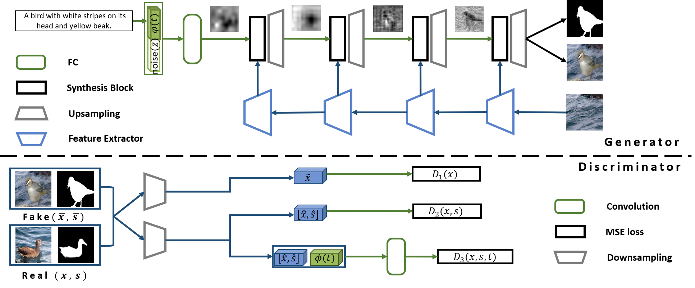
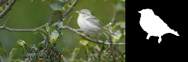
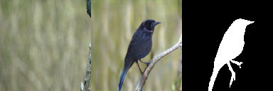
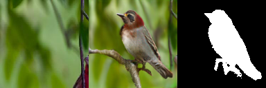

# Semantic Image Synthesis via Adversarial Learning

This is a PyTorch implementation of the paper [MC-GAN: Multi-conditional Generative Adversarial Network for Image (BMVC 2018)](https://arxiv.org/abs/1805.01123).



## Requirements
- python 2.7
- [PyTorch](https://github.com/pytorch/pytorch) 0.3
- [Torchvision](https://github.com/pytorch/vision)
- easydict
- pandas
- [torchtext](https://github.com/pytorch/text)
- [NLTK](http://www.nltk.org)

## Model1 
please download a pre-trained model [bird](https://drive.google.com/file/d/1G-QjWurZXcTpkxro_zvTCpbvPbY3i1Vp/view?usp=sharing) and base image for training [base_img_bird](https://drive.google.com/file/d/1tVmgD2MrSOyD-V76CZPsLYxrEdT6gZFj/view?usp=sharing), [base_img_flower](https://drive.google.com/file/d/1eX-graAnZySSHuRF4Kseg5MVemrMp_-P/view?usp=sharing)


## Additional Datasets
Prepare the Caltech-200 birds dataset and Oxford-102 flowers dataset for reproducing main results in [this repository](https://github.com/hanzhanggit/StackGAN)


## Run Model1
Train a MC-GAN model on the bird (CUB) dataset using our preprocessed embeddings:
python main.py --cfg cfg/birds_3stages.yml --gpu 0

Test a MC-GAN model

Change cfg/*.yml files to generate images from pre-trained models.
1. Train.flag = False
2. Train.net_G = 'path of pre-trianed model'

## result
   


## Model2
please download a pre-trained model [bird](https://drive.google.com/file/d/1gYojb7WlR6_vtSESzIYXzHb4RmeQ05E_/view?usp=sharing) and [text embedding model](https://drive.google.com/file/d/1rJbaZquanUeO9-9c0xdJQiZDuRpjIa_Z/view?usp=sharing) 

## Run Model2

- Text embdding
    - run  train_text_embeddng.py
- Train Generative model
    - run train_MCb.py
- Test
    - run test.py

please follow result in [this repository](https://github.com/woozzu/dong_iccv_2017)


## Results


##Citing MC-GAN

If you find MC-GAN useful in your research, please consider citing:
```
@inproceedings{park2018mc,
  title={MC-GAN: Multi-conditional Generative Adversarial Network for Image Synthesis},
  author={Park, Hyojin and Yoo, Youngjoon and Kwak, Nojun},
  booktitle={The British MachineVision Conference (BMVC)},
  year={2018}
}
```

## Acknowledgements
- [Text to image synthesis](https://github.com/reedscot/icml2016)
- [StackGAN](https://github.com/hanzhanggit/StackGAN)
- [stackGAN++](https://github.com/hanzhanggit/StackGAN-v2)
- [Semantic Image Synthesis](https://github.com/woozzu/dong_iccv_2017)